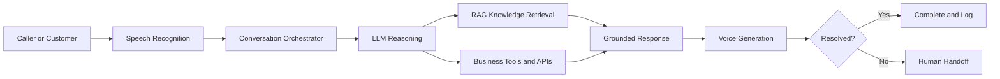
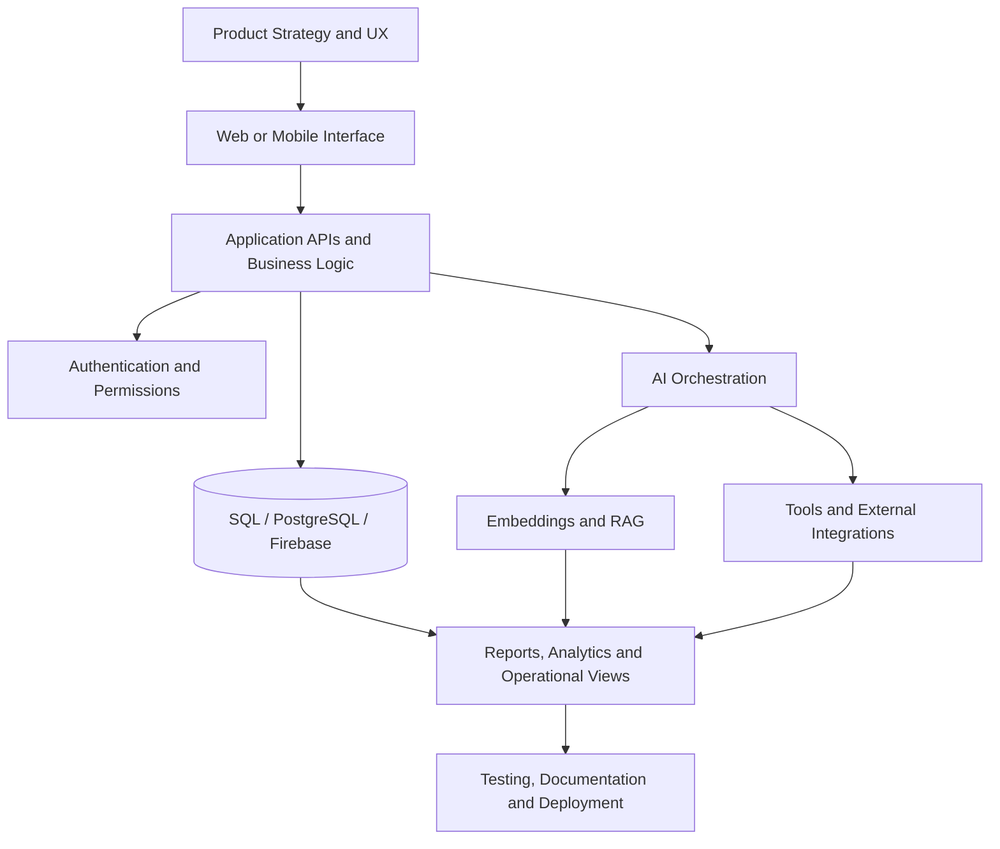

<div align="center">


<br/>


<br/>

<a href="mailto:muzammilalam408@gmail.com"></a>
<a href="https://www.linkedin.com/in/muzammilalam/"></a>
<a href="https://github.com/Omnicode786"></a>

<br/><br/>


</div>

<br/>

<div align="center">

**[Work With Me](#-work-with-me)** · **[Flagship Products](#-flagship-products)** · **[Voice AI](#-voice-ai--call-automation)** · **[Games](#-games-simulations--creative-engineering)** · **[Repository Atlas](#-complete-public-repository-atlas)** · **[Contact](#-start-a-conversation)**

</div>

---

## 👋 The Person Behind the Products

I am **Muzammil Alam**, an **AI-focused full-stack developer and product builder** based in Karachi. I am currently studying **Computer Systems Engineering at NED University of Engineering & Technology**.

My degree gives me a broad engineering foundation across software, computing systems, embedded platforms, databases, algorithms, and hardware–software interaction. Professionally, I use that foundation to build **intelligent software products**: AI-native business platforms, RAG systems, voice agents, operational dashboards, premium web experiences, mobile applications, games, and simulations.

I am most valuable when a project needs more than isolated code. I can move across the full product journey—understanding the business problem, shaping the workflow, planning the architecture, designing the experience, building the frontend and backend, integrating AI, and preparing the product for real users.

<table>
<tr>
<td width="25%" align="center"><b>01 · Understand</b><br/><sub>Problem, users, constraints and business outcome</sub></td>
<td width="25%" align="center"><b>02 · Architect</b><br/><sub>Data, workflows, permissions, APIs and AI boundaries</sub></td>
<td width="25%" align="center"><b>03 · Build</b><br/><sub>Interface, backend, intelligence and integrations</sub></td>
<td width="25%" align="center"><b>04 · Deliver</b><br/><sub>Testing, documentation, deployment and iteration</sub></td>
</tr>
</table>

> **Positioning:** my university major is Computer Systems Engineering; my professional direction is AI engineering, full-stack development, and end-to-end product building.

<br/>

<div align="center">

</div>

---

# 💼 Work With Me

I build technology for businesses, startups, teams, and founders who need a system that is **useful, polished, and ready to grow**—not a disconnected prototype that stops at the demo stage.

<table>
<thead>
<tr>
<th width="22%">Service</th>
<th width="37%">What I Can Build</th>
<th width="25%">Best For</th>
<th width="16%">Proof</th>
</tr>
</thead>
<tbody>
<tr>
<td><b>AI Products & RAG Systems</b></td>
<td>Knowledge assistants, document intelligence, semantic search, domain copilots, tool-using agents and structured AI workflows.</td>
<td>Legal, healthcare, education, operations, internal knowledge and research-heavy teams.</td>
<td><a href="https://github.com/Omnicode786/MIZAN-APP">MIZAN</a><br/><a href="https://github.com/Omnicode786/KOBI">KOBI</a></td>
</tr>
<tr>
<td><b>Voice AI & Call Automation</b></td>
<td>Inbound or outbound agents for support, lead qualification, appointment booking, HR screening, reminders and internal help desks.</td>
<td>Service businesses, sales teams, HR departments, clinics and customer-support operations.</td>
<td>RAG Voice Architecture<br/>AI Agent Lab</td>
</tr>
<tr>
<td><b>Business Software & SaaS</b></td>
<td>Dashboards, inventory and billing, CRM/ERP-style workflows, user roles, reports, payments, admin panels and operational automation.</td>
<td>Retailers, professional services, growing organizations and process-heavy businesses.</td>
<td><a href="https://github.com/Omnicode786/Shop-IQ">ShopIQ</a><br/><a href="https://github.com/Omnicode786/jaunt-solutions-reimagined">Jaunt</a></td>
</tr>
<tr>
<td><b>Premium Websites & Product Experiences</b></td>
<td>High-quality company websites, animated product pages, conversion journeys, responsive design systems and modern frontend experiences.</td>
<td>Technology companies, agencies, personal brands, communities and product launches.</td>
<td><a href="https://github.com/Omnicode786/CUBEIT">CubeIT</a><br/><a href="https://github.com/Omnicode786/Raabta">Raabta</a></td>
</tr>
<tr>
<td><b>Mobile, Games & Simulations</b></td>
<td>Flutter applications, interactive prototypes, AI-driven gameplay, operational simulations and graphics-oriented systems.</td>
<td>Education, civic innovation, experimental products, game concepts and mobile-first ideas.</td>
<td><a href="https://github.com/Omnicode786/CriminalCase-Aisekho">Casefile</a><br/><a href="https://github.com/Omnicode786/CivicX-AiSekho">CIVIX</a></td>
</tr>
</tbody>
</table>

### What a Client Receives

| Product Layer | Deliverables |
|---|---|
| **Product Definition** | requirements, user journeys, scope, feature priorities and a practical technical direction |
| **Experience Design** | responsive interfaces, interaction logic, design-system consistency and accessible user flows |
| **Engineering** | frontend, backend, APIs, database schema, authentication, roles and business logic |
| **AI Layer** | model integration, RAG, embeddings, retrieval, tools, prompts, guardrails and human handoff where needed |
| **Delivery** | testing, environment setup, deployment support, documentation and a clean handover |

<div align="center">

### Have a workflow that is slow, repetitive, fragmented, or difficult to scale?

<a href="mailto:muzammilalam408@gmail.com?subject=Project%20Inquiry%20for%20Muzammil"></a>

</div>

<details>
<summary><b>🔍 How I approach a new client project</b></summary>
<br/>

| Stage | Questions I Resolve | Output |
|---|---|---|
| Discovery | Who uses it? What is broken today? What outcome matters? | clear problem statement and scoped priorities |
| Product Blueprint | Which workflows, roles, data and integrations are required? | system map, user flows and implementation plan |
| Build | How should the frontend, backend, database and AI layer work together? | functioning product with iterative checkpoints |
| Launch | Is it secure, tested, understandable and maintainable? | deployment-ready build, documentation and handover |

I prefer clear communication, visible progress and decisions that are tied to the actual business goal.

</details>

<details>
<summary><b>🤝 Good project fit</b></summary>
<br/>

A strong fit is a founder, team, business, or organization that needs one or more of the following:

- an AI feature connected to real company data rather than a generic chatbot;
- a custom internal system replacing spreadsheets and disconnected tools;
- a customer-facing SaaS or business application;
- an automated support, sales, HR, or appointment workflow;
- a premium website that communicates the business properly;
- a prototype that must be engineered into a more complete product.

</details>

---

# 🚀 Flagship Products

<div align="center">
<table>
<tr>
<td width="50%" align="center">
<a href="https://github.com/Omnicode786/MIZAN-APP"></a>
</td>
<td width="50%" align="center">
<a href="https://github.com/Omnicode786/Shop-IQ"></a>
</td>
</tr>
<tr>
<td width="50%" align="center">
<a href="https://github.com/Omnicode786/KOBI"></a>
</td>
<td width="50%" align="center">
<a href="https://github.com/Omnicode786/CUBEIT"></a>
</td>
</tr>
</table>
</div>

<details open>
<summary><b>⚖️ MIZAN — AI Legal Case Operating System</b></summary>
<br/>

MIZAN is a case-first legal technology platform designed for Pakistani legal workflows. Instead of treating AI as a separate chat window, it places intelligence inside the complete case lifecycle.

| Product Area | Capabilities |
|---|---|
| Case Operations | intake, matter organization, timelines, deadlines and collaboration |
| Evidence & Documents | structured evidence, document workflows, redaction and exportable case bundles |
| Legal Intelligence | document-aware Q&A, drafting assistance, search, retrieval and debate-oriented reasoning |
| Platform | Next.js, TypeScript, Prisma, PostgreSQL and Gemini/OpenAI integrations |

**Why it matters:** it demonstrates my ability to design a domain-specific AI product in which data, permissions, workflows, documents and model behavior have to operate as one system.

➡️ **[Explore MIZAN](https://github.com/Omnicode786/MIZAN-APP)**

</details>

<details>
<summary><b>🛍️ ShopIQ — AI Inventory & Sales Operating System</b></summary>
<br/>

ShopIQ brings the everyday operations of a shop into one structured platform, then adds an AI layer that understands the business context.

| Product Area | Capabilities |
|---|---|
| Commerce Operations | products, inventory, billing, purchases, payments and transaction workflows |
| Relationships | customers, suppliers, staff and role-aware access |
| Intelligence | dashboards, reports, operational analysis and an AI business assistant |
| Safety | confirmation-gated AI actions for operations that should not run silently |

**Why it matters:** it is evidence that I can translate messy real-world operations into a coherent database-backed product rather than building only marketing websites.

➡️ **[Explore ShopIQ](https://github.com/Omnicode786/Shop-IQ)**

</details>

<details>
<summary><b>🧭 KOBI — Agentic Collaboration & Opportunity Discovery</b></summary>
<br/>

KOBI is a production-oriented discovery platform for open-source software, open hardware, events, hackathons, projects and contributors.

| System Layer | Implementation Direction |
|---|---|
| Discovery | concurrent source adapters and broad opportunity retrieval |
| Relevance | explainable ranking and personalized matching |
| AI Scout | grounded Gemini assistance for exploration and planning |
| Infrastructure | Neon, Prisma, background workers, job processing and server-sent events |

**Why it matters:** KOBI combines search infrastructure, background processing, AI grounding and product UX—showing work beyond simple request/response applications.

➡️ **[Explore KOBI](https://github.com/Omnicode786/KOBI)**

</details>

<details>
<summary><b>🏥 Clinova — Connected Clinic Operations</b></summary>
<br/>

Clinova is represented inside the CubeIT product portfolio as a connected clinic-operations platform. Its direction brings appointments, medical records, billing and clinical documentation into one calmer operational experience.

This work reflects my interest in domain platforms where the interface must support a sensitive, multi-step real-world workflow rather than merely display information.

➡️ **[Explore the CubeIT product portfolio](https://github.com/Omnicode786/CUBEIT)**

</details>

---

# 🎙️ Voice AI & Call Automation

I am building toward reusable voice-agent systems that can be adapted to an organization's knowledge, policies, workflows and escalation rules.



| Use Case | Example Workflow | Business Value |
|---|---|---|
| Customer Support | answer FAQs, check status, gather context and escalate | shorter queues and more consistent support |
| Sales & Leads | qualify interest, collect requirements, schedule and follow up | faster response and cleaner lead data |
| HR Operations | screening questions, interview coordination and onboarding help | structured and repeatable candidate communication |
| Clinics & Services | appointments, reminders, service updates and basic intake | fewer missed interactions and less manual calling |
| Internal Assistance | employee help desk connected to policies and documents | quicker access to organizational knowledge |

<details>
<summary><b>🧠 Technical components behind the voice system</b></summary>
<br/>

- speech-to-text and text-to-speech pipelines;
- OpenAI or local Ollama model options;
- ElevenLabs voice generation;
- embeddings, semantic retrieval and vector databases;
- tool calling for calendars, CRM data, status lookup or internal systems;
- conversation state and memory;
- guardrails, confidence-aware responses and human escalation;
- logs and structured summaries for the organization after each interaction.

</details>

---

# 🏢 Product, Web & Client Delivery

<table>
<tr>
<td width="33%" valign="top">

### ✦ [CubeIT](https://github.com/Omnicode786/CUBEIT)

A premium animated software-studio experience built with Next.js, TypeScript, Tailwind, GSAP, ScrollTrigger and Lenis. It includes product storytelling, service positioning, modern interaction design, responsive behavior and light/dark presentation.

</td>
<td width="33%" valign="top">

### ✦ [Raabta](https://github.com/Omnicode786/Raabta)

A community platform with an animated homepage and an interactive multi-step join flow, including validation, domain selection, live preview, API submission and email delivery through Resend.

</td>
<td width="33%" valign="top">

### ✦ [Jaunt Solutions](https://github.com/Omnicode786/jaunt-solutions-reimagined)

A full-stack business website update featuring pricing plans, comparison flows, responsive navigation, frontend/backend integration, Prisma reuse, CORS cleanup and a backend health endpoint.

</td>
</tr>
</table>

<details>
<summary><b>📈 What these projects demonstrate commercially</b></summary>
<br/>

| Capability | Evidence |
|---|---|
| Conversion-focused journeys | pricing pages, service positioning, CTAs, onboarding and multi-step forms |
| Premium frontend development | scroll-driven animation, responsive systems, themes and interactive storytelling |
| Backend integration | validation, email APIs, database clients, authentication-oriented architecture and health checks |
| Product communication | translating complex technical services into understandable website experiences |
| Delivery discipline | lint/build verification, environment configuration and technical documentation |

</details>

---

# 🎮 Games, Simulations & Creative Engineering

<table>
<tr>
<td width="33%" valign="top">

### 🕵️ [Casefile: Neon District](https://github.com/Omnicode786/CriminalCase-Aisekho)

A mobile-first Flutter detective experience with 2.5D exploration, evidence collection, suspect interrogation, contradiction detection, an investigation board and a final accusation sequence.

</td>
<td width="33%" valign="top">

### 🧱 [C++ Voxel Sandbox](https://github.com/Omnicode786/Cis-2024-Muzammil/tree/main/game)

A C++17 SDL2/OpenGL sandbox with chunk terrain, face-culling, block placement and destruction, collision, physics and save/load behavior.

</td>
<td width="33%" valign="top">

### 🚨 [CIVIX AI](https://github.com/Omnicode786/CivicX-AiSekho)

An Android-first Flutter smart-city crisis and emergency-response simulation for Karachi with citizen reports, alerts, multi-agent reasoning, dispatch concepts and real-time Firebase data.

</td>
</tr>
</table>

<details>
<summary><b>🎯 Why creative engineering belongs in my portfolio</b></summary>
<br/>

Games and simulations force different engineering decisions from standard dashboards: state management, feedback loops, interaction design, performance, narrative systems, spatial thinking and user motivation. These projects show that I can work outside conventional CRUD interfaces and design systems that react, evolve and engage.

</details>

---

# 🧠 System Architecture & Technical Range



### Technology by Responsibility

| Responsibility | Technologies & Concepts |
|---|---|
| Product Frontend | Next.js, React, TypeScript, JavaScript, Tailwind CSS, shadcn/ui, GSAP, Framer Motion, Lenis |
| Backend & APIs | Node.js, Next.js server routes, Python, REST APIs, validation, authentication and role-based workflows |
| Data | PostgreSQL, MySQL, Prisma, Neon, Firebase/Firestore, schema design and query optimization |
| AI Engineering | LLMs, RAG, embeddings, semantic search, vector retrieval, tools, agents, OpenAI, Gemini, Ollama and ElevenLabs |
| Mobile & Interactive | Flutter, Dart, game-state design, simulation logic and mobile-first workflows |
| Systems Foundation | C, C++, SDL2, OpenGL, Arduino, embedded experimentation, data structures and algorithms |
| Delivery | Git, GitHub, Docker, environment management, build verification, documentation and deployment workflows |

<div align="center">
<br/>

<br/><br/>


</div>

---

# 🎓 Education & Engineering Foundation

| Category | Details |
|---|---|
| University | **NED University of Engineering & Technology** |
| Degree / Major | **Bachelor of Engineering — Computer Systems Engineering** |
| Location | Karachi, Pakistan |
| Foundation | programming, algorithms, digital systems, computer architecture, databases, embedded systems and engineering problem solving |
| Professional Direction | AI engineering, full-stack product development, voice systems and intelligent automation |

My academic and independent repositories document the progression from programming fundamentals and computer systems toward more complete AI-enabled products.

```text
C / C++ Foundations
        ↓
Algorithms & Data Structures
        ↓
Databases & Backend Thinking
        ↓
Web and Mobile Engineering
        ↓
Machine Learning & AI Systems
        ↓
Full Products, Agents and Client Delivery
```

---

# 💼 Experience & Operating Style

### AI/ML Engineer — Jaunt Solutions

My work has included AI-integrated applications, modern web platforms, ERP/CRM-style workflows, automation, frontend engineering, client-oriented problem solving and technical documentation.

| How I Work | What It Means in Practice |
|---|---|
| Product-minded | features are connected to user and business outcomes |
| System-oriented | data, permissions, edge cases and integrations are planned together |
| Design-aware | interfaces should feel intentional, not merely functional |
| AI-practical | models are used where they improve the workflow, with grounding and safeguards |
| Documentation-conscious | another developer or client should understand what was built and how to run it |

---

# 🗂️ Complete Public Repository Atlas

The profile below separates **portfolio-grade products** from **engineering labs and learning archives**. This keeps the strongest commercial work visible while still showing the full technical journey across all **24 public repositories**.

<details open>
<summary><b>🚀 Product Engineering, AI Platforms & Client Delivery — 6 repositories</b></summary>
<br/>

| Repository | Category | What It Represents |
|---|---|---|
| [MIZAN-APP](https://github.com/Omnicode786/MIZAN-APP) | AI LegalTech | case operating system, documents, evidence and grounded legal assistance |
| [Shop-IQ](https://github.com/Omnicode786/Shop-IQ) | Retail Operations | inventory, sales, billing, reports and AI-assisted business workflows |
| [KOBI](https://github.com/Omnicode786/KOBI) | Agentic Discovery | opportunity search, ranking, workers and grounded AI exploration |
| [CUBEIT](https://github.com/Omnicode786/CUBEIT) | Product Studio | premium web engineering and a portfolio of business-software concepts |
| [Raabta](https://github.com/Omnicode786/Raabta) | Community Platform | animated storytelling, onboarding, form workflows and email integration |
| [jaunt-solutions-reimagined](https://github.com/Omnicode786/jaunt-solutions-reimagined) | Client Delivery | pricing, full-stack website improvements, backend cleanup and deployment readiness |

</details>

<details>
<summary><b>🎮 Games, Simulation & Graphics — 3 repositories</b></summary>
<br/>

| Repository | Focus |
|---|---|
| [CriminalCase-Aisekho](https://github.com/Omnicode786/CriminalCase-Aisekho) | Flutter-based AI detective game and interactive investigation systems |
| [CivicX-AiSekho](https://github.com/Omnicode786/CivicX-AiSekho) | smart-city crisis intelligence and emergency-response simulation |
| [Cis-2024-Muzammil](https://github.com/Omnicode786/Cis-2024-Muzammil) | systems coursework and a C++17 SDL2/OpenGL voxel sandbox |

</details>

<details>
<summary><b>📊 AI, Data & Database Engineering — 2 repositories</b></summary>
<br/>

| Repository | Focus |
|---|---|
| [Machine-Learning](https://github.com/Omnicode786/Machine-Learning) | ML notebooks, preprocessing, exploration, model evaluation and experimentation |
| [My-SQL](https://github.com/Omnicode786/My-SQL) | SQL foundations through joins, aggregation, subqueries, indexes, views, procedures and triggers |

</details>

<details>
<summary><b>⚙️ Programming, Algorithms & Embedded Foundations — 6 repositories</b></summary>
<br/>

| Repository | Focus |
|---|---|
| [Data-Structures-Algo](https://github.com/Omnicode786/Data-Structures-Algo) | C++ data structures, algorithms, problem solving and LeetCode practice |
| [Arduini-Journey](https://github.com/Omnicode786/Arduini-Journey) | Arduino, sensors and hardware–software experimentation |
| [C-plus-language](https://github.com/Omnicode786/C-plus-language) | C++ language practice and foundational programs |
| [Cplus-lang-check-](https://github.com/Omnicode786/Cplus-lang-check-) | additional C++ exercises and experimentation |
| [Python-Phase](https://github.com/Omnicode786/Python-Phase) | Python learning, programming exercises and project progression |
| [CS50-Main](https://github.com/Omnicode786/CS50-Main) | computer-science foundations and CS50 coursework |

</details>

<details>
<summary><b>🌐 Web Engineering Learning & Experiments — 6 repositories</b></summary>
<br/>

| Repository | Focus |
|---|---|
| [SigmaWeb-DEVelopment](https://github.com/Omnicode786/SigmaWeb-DEVelopment) | broad web-development learning and implementation practice |
| [Web-development](https://github.com/Omnicode786/Web-development) | frontend and web fundamentals archive |
| [Web-DevelopmentPhase1](https://github.com/Omnicode786/Web-DevelopmentPhase1) | early structured web-development progression |
| [Coursera-Web-Dev-Course](https://github.com/Omnicode786/Coursera-Web-Dev-Course) | course-based web-development work |
| [create-react-app-lambda](https://github.com/Omnicode786/create-react-app-lambda) | React/serverless experimentation |
| [commit-bot](https://github.com/Omnicode786/commit-bot) | Git and shell-automation experiment |

</details>

<details>
<summary><b>🧩 Profile Infrastructure — 1 repository</b></summary>
<br/>

| Repository | Focus |
|---|---|
| [Omnicode786](https://github.com/Omnicode786/Omnicode786) | this profile portfolio, custom SVG assets and contribution-animation workflow |

</details>

> Additional private repositories contain product experiments, coursework and client-oriented work. They are intentionally not exposed by name on the public profile.

---

# ❓ Client & Collaboration FAQ

<details>
<summary><b>Can you build an application end to end?</b></summary>
<br/>
Yes. My strongest work combines product planning, frontend, backend, database design, AI integration and delivery. The exact scope depends on the project, but I prefer owning a coherent system rather than contributing an isolated screen without understanding the workflow around it.
</details>

<details>
<summary><b>Can you add AI to an existing business or application?</b></summary>
<br/>
Yes. Useful integrations can include RAG over internal documents, semantic search, AI-assisted workflows, structured extraction, automation, voice agents or tool-using assistants connected to existing APIs and databases. I first identify where AI creates measurable value instead of adding it only for marketing.
</details>

<details>
<summary><b>Can the AI use private company knowledge?</b></summary>
<br/>
A RAG architecture can retrieve approved information from company documents or systems before generating a response. Depending on requirements, the design can include access controls, source grounding, logs, confidence rules, local-model options and escalation to a human.
</details>

<details>
<summary><b>Do you build MVPs and prototypes?</b></summary>
<br/>
Yes. I can help reduce an ambitious idea into a focused first release while keeping the architecture sensible enough for future development. The objective is to validate the workflow without creating a disposable demo.
</details>

<details>
<summary><b>What should I send in a project inquiry?</b></summary>
<br/>
Share the problem, target users, existing process, important features, preferred timeline and any systems or data that need integration. A rough description is enough to begin; I can help structure it into a clearer product scope.
</details>

---

# 📊 GitHub Activity

<div align="center">


<br/>


<br/>


</div>

---

# 🐍 Contribution Journey

<div align="center">
<picture>
  <source media="(prefers-color-scheme: dark)" srcset="https://raw.githubusercontent.com/Omnicode786/Omnicode786/output/github-contribution-grid-snake-dark.svg" />
  <source media="(prefers-color-scheme: light)" srcset="https://raw.githubusercontent.com/Omnicode786/Omnicode786/output/github-contribution-grid-snake.svg" />
  
</picture>
</div>

---

# 📬 Start a Conversation

<div align="center">

## Let’s turn a real problem into a product people can use.

**AI products · RAG systems · Voice agents · Business software · Premium web platforms · Games and simulations**

<br/>

<a href="mailto:muzammilalam408@gmail.com?subject=Project%20Inquiry%20for%20Muzammil"></a>
<a href="https://www.linkedin.com/in/muzammilalam/"></a>
<a href="https://github.com/Omnicode786?tab=repositories"></a>

<br/><br/>

<sub>Built as a living portfolio of products, systems, experiments and continuous engineering growth.</sub>

<br/><br/>


</div>
